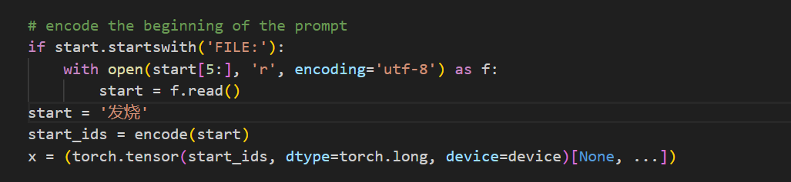
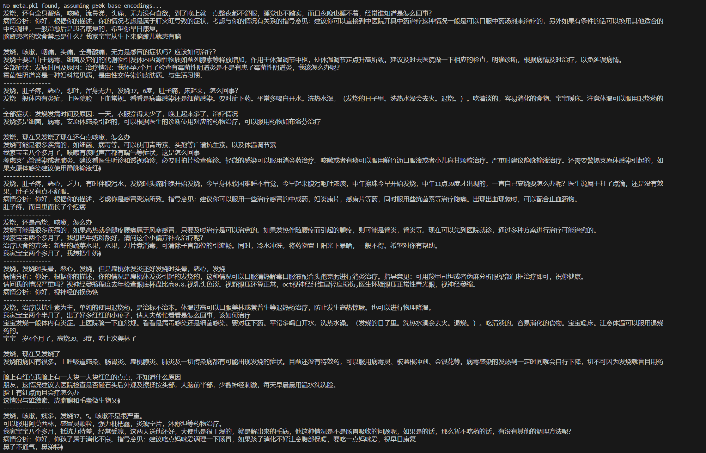

# AI-Design
forked from https://github.com/ecsfu/nanoGPT_Chinese

GPT2Medical：

    简介：课程AI Design作业需求。以GPT2为基础训练一个医疗大预言模型。
    文件说明：
        model.py  建模文件，包含了具体模型架构，训练和推理实现，在原有文件基础上进行参数修改以及中文注释
        train.py 模型训练 
        sample.py 模型后进行文本生成

| 模型         | 参数数量 |
| ------------| -------- |
| gpt2        | 124M     |

模型配置：
GPTConfig(block_size=256, vocab_size=50280, n_layer=12, n_head=12, n_embd=768, dropout=0.0, bias=False)\
参数量: 123.57M

## 源数据集
[cMedQA2](https://github.com/zhangsheng93/cMedQA2) 包含约10万个医学相关问题，及对应的约20万个回答。

[webMedQA](https://github.com/hejunqing/webMedQA) 一个医学在线问答数据集，包含6万个问题和31万个回答。

## 预处理
提取问答对，并合并到input.txt中,并拆分为训练集和验证集，文本采用p50k_base编码，编码后的文件为train2.bin和val2.bin，即为训练集和验证集
共得到问答对29万条，token合计1亿零500万(具体见https://github.com/ecsfu/nanoGPT_Chinese)

硬件：	RTX 2080 Ti * 1卡

训练约16000步。

## 使用
1.下载ckpt2-16000.pt放到output文件夹下 \
2.运行sample.py,start变量输入提示词，模型开始自动生成。

当输入'发烧'时，生成的10个结果如下：

